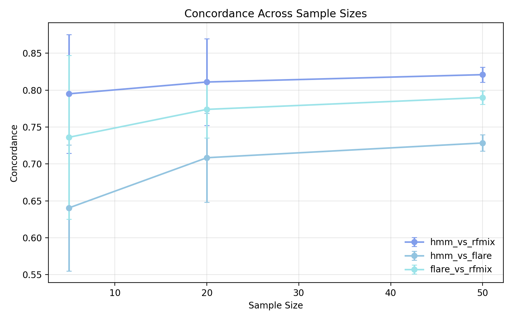
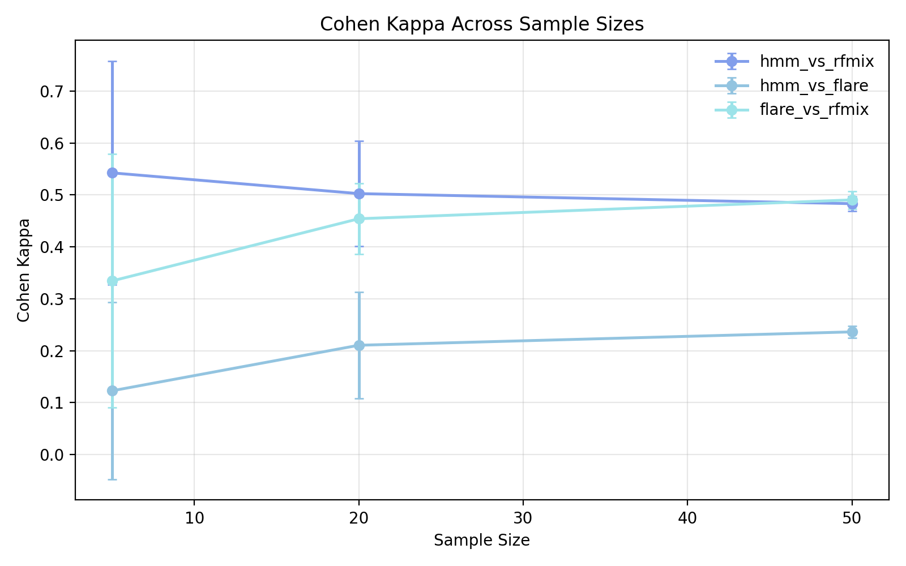
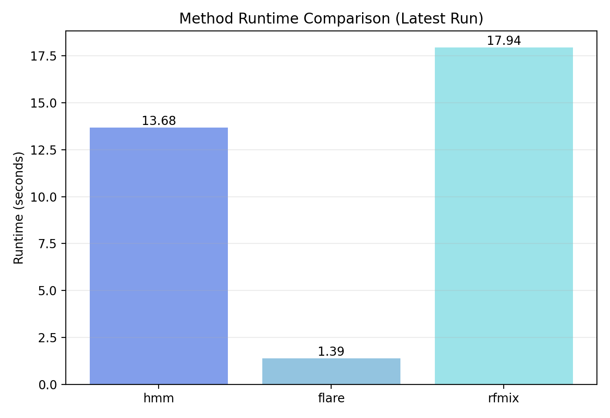
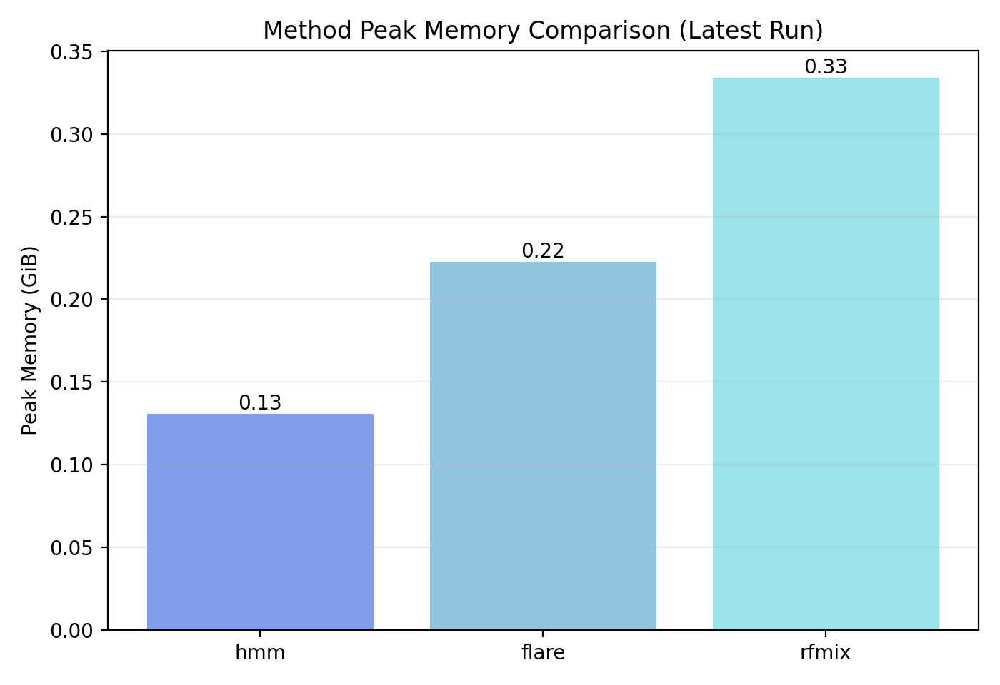

# Model Benchmarking: RFMix & FLARE Comparison

This folder contains tools and results for evaluating and comparing the HMM model against external local-ancestry methods (RFMix and FLARE).

## Prepping the Benchmark

The benchmark is configured to evaluate methods in a haplotype-consistent way:
- The HMM runs as a single-haplotype `K`-state model (`K=2`: `CEU`, `YRI`) on both phased haplotypes.
- FLARE and RFMix outputs are converted to per-SNP predictions with explicit haplotype columns (`hap1_state`, `hap2_state`).
- Sweep comparisons run in haplotype mode (`CEU,YRI` labels), so all method pairs are evaluated in the same state space.

Below are the setup, run steps, and latest results.

## Install Prerequisites

`run_benchmark.sh` assumes these tools are already available:
- `java` (for FLARE)
- `rfmix` (CLI on `PATH`)
- `bcftools` and `tabix`

Example setup in a conda environment:

```bash
conda activate hmm_env
conda install -c conda-forge openjdk -y
conda install -c bioconda rfmix bcftools tabix -y
```

Download FLARE jar into `benchmark/`:

```bash
wget https://faculty.washington.edu/browning/flare.jar -O benchmark/flare.jar
```

Quick checks:

```bash
java -version
rfmix --help
test -f benchmark/flare.jar && echo "FLARE jar found"
```

## Running the Benchmark

This command runs everything:
```bash
bash benchmark/run_benchmark.sh all
```

If you only need to run a specific stage, use the following commands:
```bash
bash benchmark/run_benchmark.sh prepare
bash benchmark/run_benchmark.sh flare
bash benchmark/run_benchmark.sh rfmix
bash benchmark/run_benchmark.sh convert
bash benchmark/run_benchmark.sh model
bash benchmark/run_benchmark.sh sweep
bash benchmark/run_benchmark.sh format
```

### Stage Mapping

- `prepare`: split query/reference files and build tool-specific maps/panel files
- `flare`: run FLARE and write raw outputs to `benchmark/results/`
- `rfmix`: run RFMix and write raw outputs to `benchmark/results/`
- `convert`: convert FLARE/RFMix raw outputs to SNP-level CSVs with `hap1_state`, `hap2_state`, `state`, and `label`
- `model`: export HMM SNP-level predictions under `benchmark/predictions/model/` with the same columns
- `sweep`: run sample-size sweeps and pairwise comparisons (default: haplotype mode, `valid-labels=CEU,YRI`)
- `format`: generate summary tables/plots and runtime-memory comparison plots

### Runtime and Memory Logging

Every benchmark stage now logs wall-clock runtime and peak resident memory (RSS) to:

- `benchmark/results/performance/stage_performance.csv`

Rows are appended per command with a `run_id`, so you can compare runs over time.

## Benchmark Results

The following results use haplotype-level evaluation (`YRI`, `CEU`) on the chr22 slice.

### Sample-Size Sweep (5 Random Repeats per N)

| Method Pair | Sample Size | Repeats | Mean Aligned Rows | Mean Samples Compared | Mean Concordance | Std Concordance | Mean Kappa | Std Kappa |
|------------|------------:|--------:|------------------:|----------------------:|-----------------:|----------------:|-----------:|----------:|
| `hmm_vs_rfmix` | 5  | 5 | 159,460.0  | 10.0  | 0.905028 | 0.043699 | 0.503085 | 0.105000 |
| `hmm_vs_rfmix` | 20 | 5 | 637,840.0  | 40.0  | 0.902313 | 0.028212 | 0.560290 | 0.072844 |
| `hmm_vs_rfmix` | 50 | 5 | 1,594,600.0 | 100.0 | 0.902035 | 0.003484 | 0.535192 | 0.010663 |
| `flare_vs_rfmix` | 5  | 5 | 9,290.0   | 10.0  | 0.845834 | 0.066366 | 0.586735 | 0.172545 |
| `flare_vs_rfmix` | 20 | 5 | 37,160.0  | 40.0  | 0.871152 | 0.016815 | 0.658600 | 0.048621 |
| `flare_vs_rfmix` | 50 | 5 | 92,900.0  | 100.0 | 0.882114 | 0.006163 | 0.689625 | 0.015792 |
| `hmm_vs_flare` | 5  | 5 | 8,550.0   | 10.0  | 0.812585 | 0.044925 | 0.376900 | 0.121279 |
| `hmm_vs_flare` | 20 | 5 | 34,200.0  | 40.0  | 0.838690 | 0.029364 | 0.440463 | 0.090654 |
| `hmm_vs_flare` | 50 | 5 | 85,500.0  | 100.0 | 0.844924 | 0.005994 | 0.422869 | 0.015401 |

As expected, variance decreases with larger sample sizes across all method pairs.

### Concordance And Kappa Trends

<p align="center">
	
	
</p>

Concordance:
- `hmm_vs_rfmix` is highest overall (~0.902 across all tested `N`), indicating strongest raw agreement.
- `flare_vs_rfmix` improves with `N` and reaches ~0.882 at `N=50`.
- `hmm_vs_flare` is consistently lower than `hmm_vs_rfmix`.

Kappa:
- `flare_vs_rfmix` has the highest chance-adjusted agreement in this run (up to ~0.690 at `N=50`).
- `hmm_vs_rfmix` remains moderate-to-strong (~0.50-0.56).
- `hmm_vs_flare` remains the lowest kappa pair.

### Key Findings (Latest Full Run)

- Highest concordance pair: `hmm_vs_rfmix` (`0.905 -> 0.902` from `N=5` to `N=50`).
- Highest kappa pair: `flare_vs_rfmix` (`0.587 -> 0.690`).
- Lowest pair: `hmm_vs_flare` remains lower than the two RFMix-based pairs.
- Stability: std for concordance and kappa shrinks notably at `N=50`.

### Runtime And Memory Comparison (Latest Run)
_Note: I performed the benchmark on my PC, so performance is a lot faster than normal computers and Datahub._
<p align="center">
	
	
</p>

- Runtime plot compares `hmm`, `flare`, and `rfmix` wall-clock time for the latest run.
- Memory plot compares peak RSS (GiB) for each method in the latest run.
- Summary CSV aggregates mean/std across all recorded runs for trend tracking.

Performance from `benchmark/plots/benchmark_performance_latest.csv`:

| Method | Runtime (s) | Peak Memory (GiB) |
|-------|------------:|------------------:|
| `flare` | 1.249 | 0.222 |
| `hmm` | 16.283 | 0.131 |
| `rfmix` | 18.092 | 0.334 |

- Runtime ranking (fastest to slowest): `flare`, `hmm`, `rfmix`.
- Memory ranking (lowest to highest): `hmm`, `flare`, `rfmix`.

## Folder Structure

```
benchmark/
├── BENCHMARK.md                   # Benchmark writeup and usage
├── run_benchmark.sh               # Single benchmark entrypoint
├── scripts/                       # Benchmark Python scripts
├── predictions/                   # Method predictions (HMM, FLARE, and RFMix)
├── results/                       # Raw outputs and comparison files
├── plots/                         # Formatted benchmark plots/tables
├── data/
└── flare.jar
```

